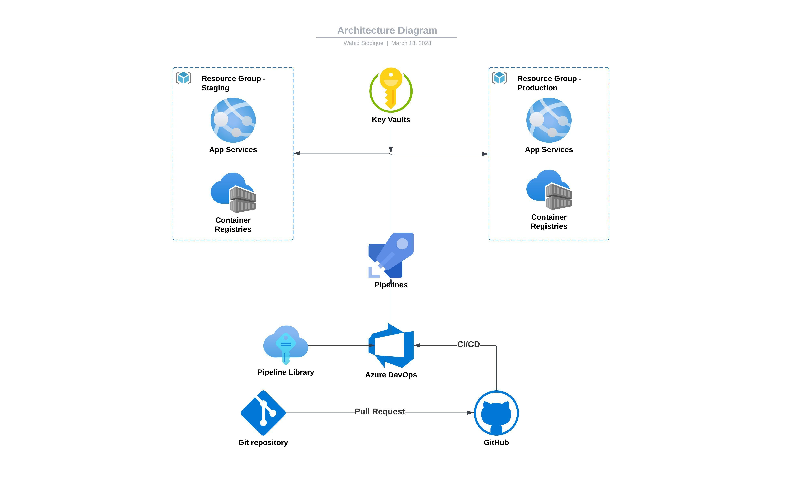

# Calculator App

## Table of Contents 
- [Introduction](#introduction)
- [Solution](#solution)
- [Architecture](#architecture-diagram)
- [Environment Management](#environment-management)
- [Manual Intervention](#manual-intervention)
- [Clean Up](#clean-up)
- [Personal Note](#personal-note)

## Introduction

The goal of this project is to deploy an existing application to most suitable Azure services using Azure DevOps Pipeline to automate the CI/CD process. The Application itself is a open source calculator application made with React js.

## Solution

I have selected Azure App Service to deploy the application. Since I am more familier with GCP, I wanted to deploy the application in a similar GCP service of Cloud Run in Azure. Azure app service helps build, deploy, and scale web applications and for this calculator app, is more suitable. 

The react application is dockerized and it's docker image is built and pushed to Azure Container Registry with a Pipeline. The pipeline is using am yml file from root folder.

Another pipeline creates an Azure App Service with Arm Template and uses the docker image from the container registry to deploy the application. For this deployment and pipeline, an infra folder is created with ARM template files and a yml file for azure pipeline.

The production app is running in this link : [https://my-calculator.azurewebsites.net](https://my-calculator.azurewebsites.net/)

## Architecture Diagram 

## Environment Management

For this solution, 2 Resource Group is created, one for staging and other for production. Using deployment slots would be more appropriate for this use case, however, the kind of subcription I used for this task didn't offer to use deployment solution. As a result, the building and pushing of docker image is done twice (one for staging and other for production environment), and two app services are created for two environment as well. 

## Manual Intervention

Ideally it would be preferable to automate everything without any manual intervention. However, I created few services manually in order to complete the task. Those are:

- Service Principal
- Two Resource Group for two environment
- Two Key Vaults in two resource group for two environment
- Two container registries in two resource groups for two environment

After Deploying the App Service with with ARM template, from App Service's Deployment Center, I have turned on the Pull image over VNet from off manually. I did not have time to figure out the appropriate way of doing it with ARM template.

## Clean Up

The most easy way of cleaning up is to delete the Resource Groups which will delete all the services within the Resource groups.

## Personal Note

- This is the first time I have used ARM template as IaC. Terraform has a bit different way of doing things, since Terraform keep track of the current state of any deployment. With ARM template, it gets tricky when we want to make some changes to the current deployments and often needs to delete previous deployment in order to make new changes. 

- It took me some time to get around with Azure DevOps since most of my CI/CD experience so far is with GCP's Cloud Build. Azure DevOps has way more functionalities than GCP's Cloud Build. However, some of the functionalities of Azure DevOps Classic Editor is still lacking in Azure Pipeline in YAML format. I would love to set up approval requirement's in each build trigger whenever a pull request is made to main branch before deploying. I could not figure out a way of doing it with YAML. Although I have created an approval mechanism before CD part to production environment from Project Settings Service Connection's Approval options, this was a work around of the functionality I wanted to use. In Classic Editor, this can be managed very easily. 

Go to [infra folder](./infra/).
